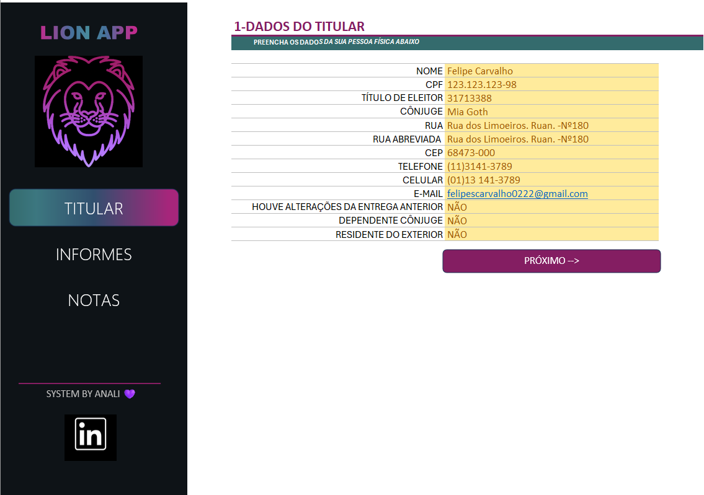
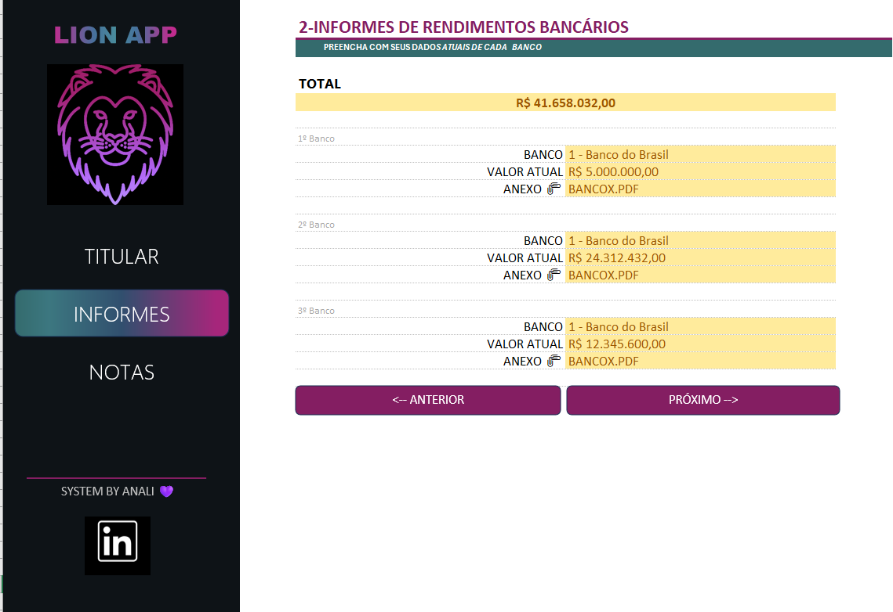
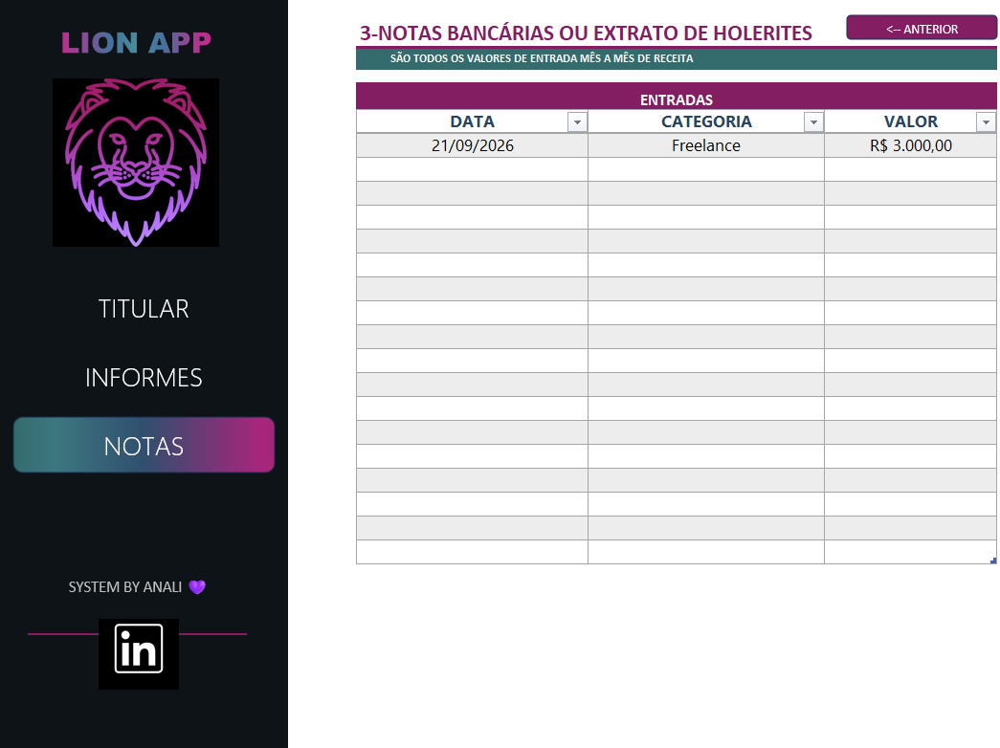

# Organizador de Imposto de Renda — Excel

> **Organização, praticidade e centralização de informações.**

Projeto desenvolvido em **Microsoft Excel** com o objetivo de criar uma ferramenta para auxiliar na organização e consolidação de informações utilizadas no processo de declaração de Imposto de Renda.

A solução reúne diferentes tipos de informações em uma única ferramenta, utilizando recursos de navegação, validação de dados, organização de tabelas, fórmulas, links rápidos e uma interface visual estruturada.


# Sobre o projeto

A proposta deste projeto é desenvolver um **agregador de informações cadastrais e financeiras**, permitindo que o usuário reúna, em um único arquivo, dados importantes para facilitar a organização das informações necessárias ao processo de declaração de Imposto de Renda.

A ferramenta foi construída integralmente no **Excel**, utilizando recursos que tornam o preenchimento mais organizado, intuitivo e eficiente.

O projeto também busca demonstrar como o Excel pode ser utilizado não apenas para cálculos, mas também para a **estruturação, validação, organização e consolidação de informações**.


# ⚠️ Dados fictícios e finalidade do projeto

> **Todos os dados apresentados neste projeto são fictícios e foram utilizados exclusivamente para fins de demonstração e visualização da ferramenta.**

As informações exibidas nas imagens e na planilha, como:

- Nome;
- CPF;
- Endereço;
- Telefone;
- E-mail;
- Informações bancárias;
- Rendimentos;
- Valores financeiros;
- Documentos e anexos;

**não representam dados reais de pessoas ou instituições.**

O projeto possui finalidade **exclusivamente educacional e demonstrativa**, sendo disponibilizado como parte de um portfólio de projetos desenvolvidos em Excel.

**Nenhuma informação pessoal ou financeira real deve ser inserida em uma versão pública deste projeto.**


# Problema que o projeto busca solucionar

Durante o processo de organização para a declaração do Imposto de Renda, diferentes informações podem estar distribuídas entre documentos, informes de rendimentos, contas bancárias, holerites e outros registros.

A proposta da ferramenta é centralizar essas informações em um único ambiente, facilitando:

- Organização dos documentos;
- Consulta das informações;
- Consolidação dos valores;
- Validação dos dados inseridos;
- Navegação entre diferentes etapas;
- Acesso rápido a documentos e anexos;
- Redução do trabalho manual de organização.

## Principais funcionalidades

A ferramenta conta com:

- Cadastro de informações do titular;
- Organização de informações bancárias;
- Registro de rendimentos e valores;
- Organização de informes e documentos;
- Registro de informações provenientes de holerites;
- Tabela para consolidação de entradas;
- Registro por data;
- Classificação por categoria;
- Registro de valores;
- Links rápidos para documentos e anexos;
- Validação de dados;
- Navegação entre diferentes etapas;
- Interface visual organizada;
- Organização centralizada das informações.

## Estrutura da ferramenta

### 1. Titular

Área destinada ao preenchimento das principais informações cadastrais do titular.

Entre os campos disponíveis estão:

- Nome;
- CPF;
- Título de eleitor;
- Cônjuge;
- Endereço;
- CEP;
- Telefone;
- Celular;
- E-mail;
- Informações complementares.

A aba também possui elementos de navegação para avançar entre as etapas da ferramenta.


### 2. Informes de rendimentos

Área destinada à organização de informações relacionadas aos rendimentos bancários.

A ferramenta permite registrar informações como:

- Instituição financeira;
- Valores;
- Total consolidado;
- Documento ou anexo correspondente.

### 3. Notas

Área destinada ao registro de informações complementares, observações e anotações importantes durante a organização dos dados.


### 4. Contas bancárias e documentos

Área destinada à organização de informações provenientes de contas bancárias, extratos e outros documentos financeiros.

As informações podem ser organizadas de acordo com:

- Data;
- Categoria;
- Valor;
- Documento de origem.


### 5. Consolidação de informações

A ferramenta possui uma estrutura para reunir informações provenientes de diferentes fontes em uma tabela organizada.

| Campo | Finalidade |
|---|---|
| Data | Identificação do período |
| Categoria | Classificação da informação |
| Valor | Registro do valor correspondente |
| Documento | Identificação da origem da informação |

Essa estrutura facilita a consulta e a organização dos dados antes da declaração.


## Navegação

A ferramenta possui uma interface com elementos de navegação que permitem ao usuário avançar ou retornar entre diferentes etapas.

Entre os recursos utilizados estão:

- **Próximo →**
- **← Anterior**
- Menu lateral;
- Abas de navegação;
- Links rápidos;
- Botões de acesso às diferentes áreas.

## Tecnologias e recursos utilizados

### Microsoft Excel

- Fórmulas e funções;
- Validação de dados;
- Listas suspensas;
- Formatação condicional;
- Hiperlinks;
- Botões de navegação;
- Organização de tabelas;
- Consolidação de dados;
- Formatação visual;
- Estruturação de interfaces;
- Organização de informações.


## Competências desenvolvidas

Este projeto permitiu desenvolver e aplicar conhecimentos relacionados a:

- Organização e tratamento de dados;
- Estruturação de planilhas;
- Criação de interfaces no Excel;
- Validação de informações;
- Automatização de tarefas;
- Utilização de fórmulas e funções;
- Navegação entre planilhas;
- Utilização de hiperlinks;
- Consolidação de informações;
- Organização de documentos;
- Experiência do usuário em planilhas.

---

## Visualização do projeto

### Dados do titular



### Informes de rendimentos



### Notas




> **As imagens apresentadas acima utilizam exclusivamente dados fictícios para demonstração da interface e das funcionalidades.**


## 📁 Estrutura do repositório

```text
organizador-imposto-renda-excel/
│
├── 📄 README.md
│
├── 📊 Organizador_Imposto_de_Renda.xlsx
│
└── 📁 imagens/
    ├── titular.png
    ├── informes.png
    ├── notas.png
    ├── contas-bancarias.png
    └── tabela-entradas.png
